# E-commerce

## Introduction
 
The project is to develop a e-commerce website where a user can buy products from the e-commerce site through bank transaction among supplier and e-commerce site.
 


## Used Technologies:
<ul>
<li>Frontend: Reactjs,HTML,CSS</li>
<li>Backend: Express.js</li>
<li>Database: Mongodb</li>
</ul>

## Clone this Project:
```
https://github.com/sani-1023/E-commerce
```

## To run the project

For Frontend(port:3000):
```
cd frontend
```
Install Depedencies :
```
npm install
```

Run Frontend :
```
npm start
```
For Backend(port:4001):
```
cd backend

```

Install Depedencies :
```
npm install
```
Run Backend :
```
npm run dev
```

if any dependency is not installed properly use this following command
```
npm install --force
```

# Some Screenshots:

<p  align="center"  >
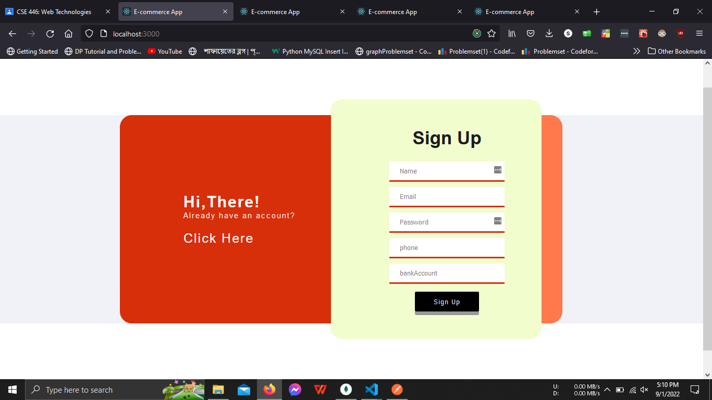 </p>

<p  align="center"  >
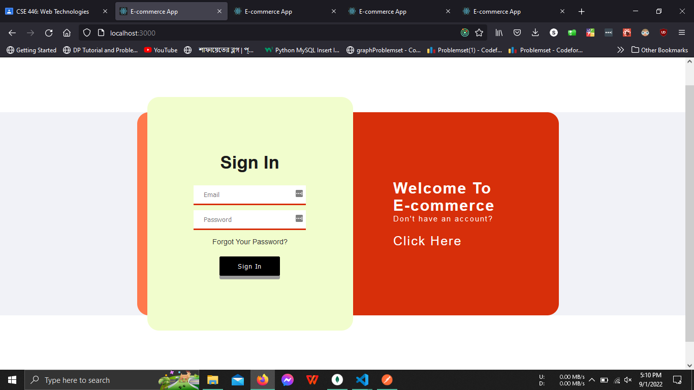 </p>

<p  align="center"  >
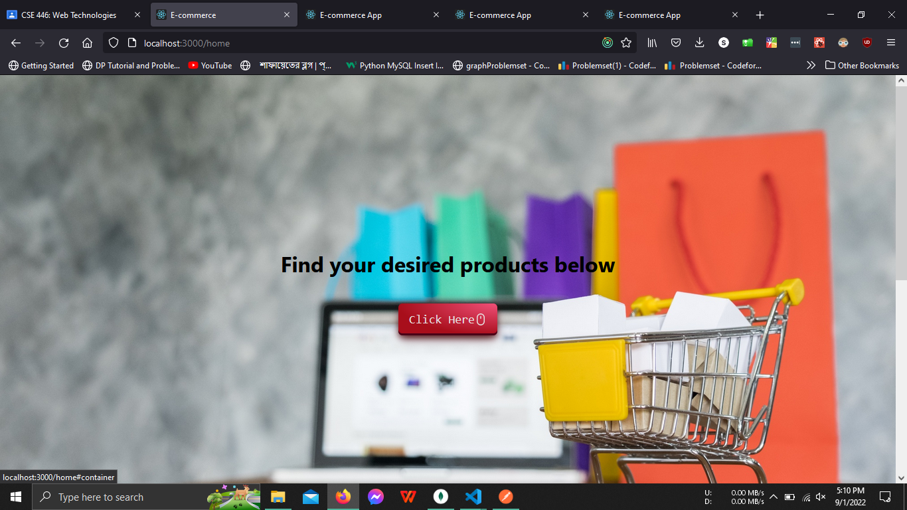 </p>

<p  align="center"  >
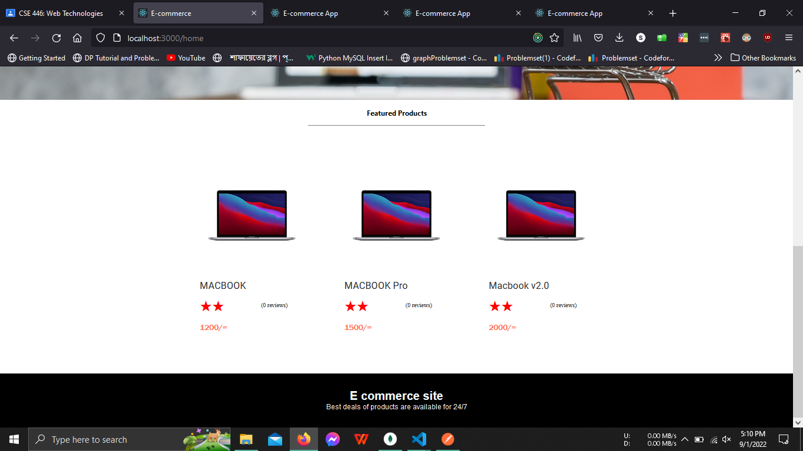 </p>

<p  align="center"  >
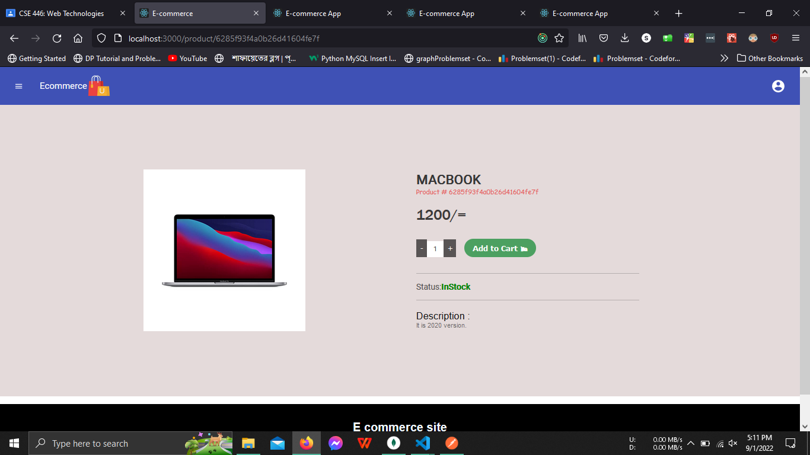 </p>

<p  align="center"  >
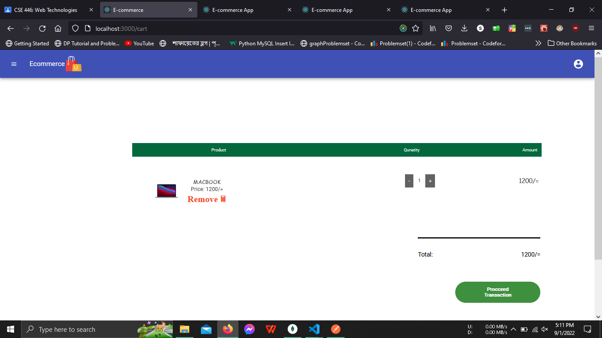 </p>

<p  align="center"  >
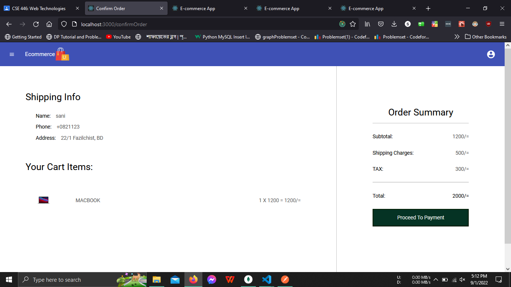 </p>

<p  align="center"  >
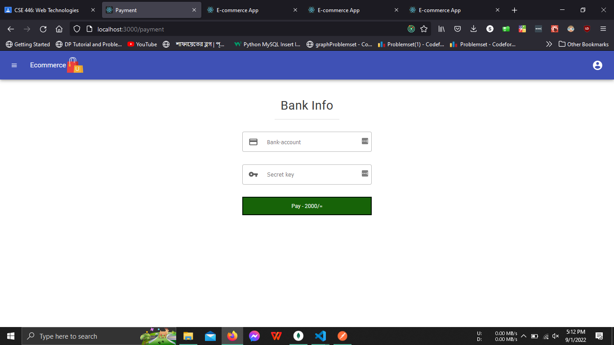 </p>

<p  align="center"  >
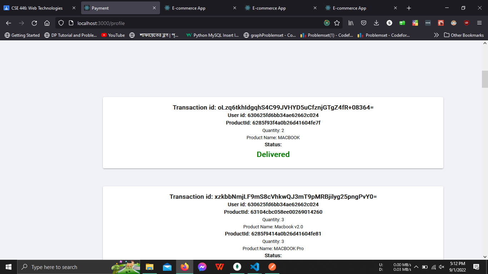 </p>

<p  align="center"  >
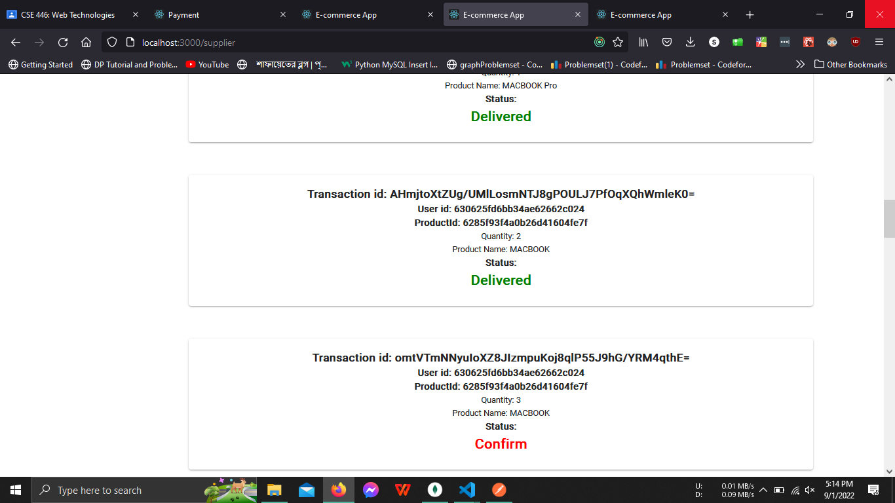 </p>

<p  align="center"  >
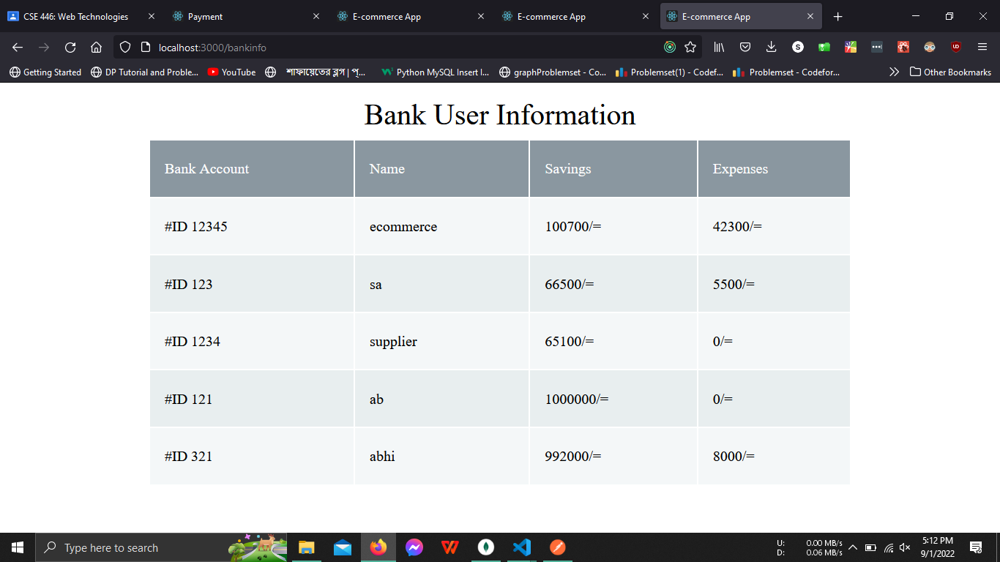 </p>


## Developed by,
- <b>[ Abhishek Dey (2017331021)](https://github.com/ABHISHEK-DEY-64150)</b>
- <b>[Sani Talukder (2017331023)](https://github.com/sani-1023)</b>


